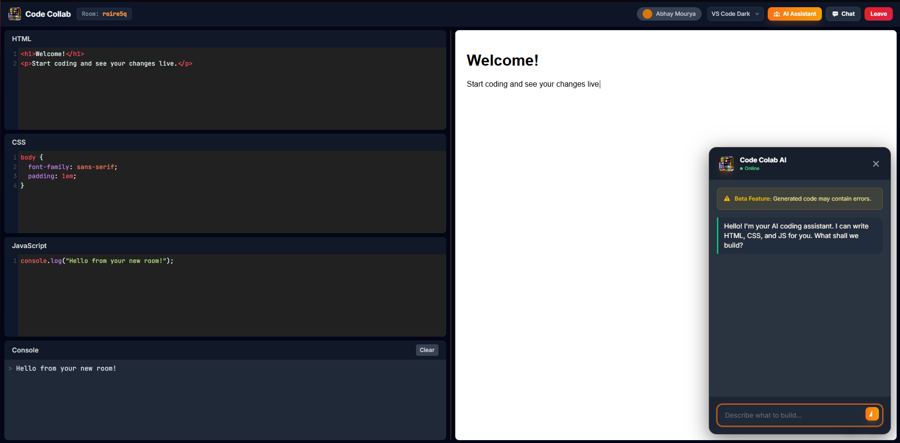

# Code Collab

Code Collab is a fast, frictionless, real-time collaborative web IDE. It allows multiple developers to jump into a shared room and write HTML, CSS, and JavaScript together, with changes instantly reflected in a live preview.

Designed for speed and simplicity, Code Collab requires no sign-ups or installations. It also features a built-in AI Assistant powered by Hugging Face to help you generate, debug, and refactor code on the fly.



***Official Copyright Registered: The source code and architecture of Code Collab are officially registered and protected by the Intellectual Property Office, Government of India (Registered 2026).***

---

##  Features

- **Real-time Collaboration:** Code together in absolute real-time without latency. Cursors and edits sync instantly across all clients in a room.
- **Built-in AI Assistant:** A floating AI panel powered by Hugging Face (`Qwen2.5-Coder`). Describe what you want to build, and the AI will generate the HTML, CSS, and JS, injecting it directly into your editors.
- **Live Preview & Console:** Instantly view the results of your code in a sandboxed iframe. A built-in console helps you catch and debug JavaScript errors.
- **Zero Friction:** No accounts, no passwords, no setup. Click "Create Room," share the URL, and start coding within seconds.
- **Export Project:** One-click download of your entire workspace as a zipped `.zip` file, ready to be dropped into VS Code or deployed.
- **Premium UI:** A beautiful, responsive, and modern interface built with Tailwind CSS, featuring custom CodeMirror themes and warm orange/amber aesthetics.
- **Room Chat:** Communicate with your team in real-time via the built-in room chat panel.

---

##  Tech Stack

- **Frontend:**
  - Vanilla HTML, CSS, JavaScript
  - [Tailwind CSS](https://tailwindcss.com/) (for styling)
  - [CodeMirror](https://codemirror.net/5/) (for syntax-highlighted code editors)
  - [JSZip](https://stuk.github.io/jszip/) (for bundling projects into `.zip` files)
- **Backend:**
  - [Node.js](https://nodejs.org/) & [Express](https://expressjs.com/) (Web Server & API)
  - [Socket.IO](https://socket.io/) (Real-time WebSocket communication)
  - [@huggingface/inference](https://huggingface.co/docs/huggingface.js/inference/README) (AI Code Generation integration)

---

##  Getting Started

### Installation

1. Clone the repository
```
git clone [https://github.com/Abhay557/Code-collab.git](https://github.com/Abhay557/Code-collab.git)
cd Code-collab
```

2. Install dependencies
```
npm install
```

3. Start the Development Server
```
npm run dev
# or
npm start
```

**Note on AI Backend: You do not need to set up a local .env file or provide your own Hugging Face API tokens. The application is pre-configured to connect directly to the hosted AI microservice at ```https://huggingface.co/spaces/Abhay557/code-collab/.```**

4. Open the App
```
Navigate to http://localhost:3000 in your web browser.
```
---

##  How to Use

1. **Create a Room**: On the home page, click "Start Coding" or "Create Public/Private Room".
2. **Share the Link**: Copy the URL from your browser's address bar and send it to a friend.
3. **Code Together**: Any code written in the HTML, CSS, or JS tabs will sync immediately to everyone in the room.
4. **Use AI**: Click the "AI Assistant" button in the top right. Type a prompt like *"Build a responsive navigation bar,"* and watch the AI write the code.
5. **Download**: Click the download icon in the bottom right corner of the preview panel to download your work as a `.zip` when you are finished.

---

##  Contributing

Contributions are welcome! If you find a bug or have a feature request, please open an issue. If you want to contribute code, feel free to submit a Pull Request.

1. Fork the Project
2. Create your Feature Branch (`git checkout -b feature/AmazingFeature`)
3. Commit your Changes (`git commit -m 'Add some AmazingFeature'`)
4. Push to the Branch (`git push origin feature/AmazingFeature`)
5. Open a Pull Request

---

##  Copyright and License

***© 2026 Abhay Mahendra Mourya. All Rights Reserved.***
***This software is officially registered with the Intellectual Property Office, Government of India.***
***While the intellectual property and core architecture are legally copyrighted, this project is proudly open-source and distributed under the MIT License. You are free to use, modify, and distribute this software, provided that the original copyright notice and permission notice are included in all copies or substantial portions of the software.
See the ```LICENSE``` file for more information.***

---


## Acknowledgements
This project is a new and expanded version of my original collaborative editor, Codependal. It builds upon the core ideas of simplicity and real-time collaboration that I explored in that initial project.

[Codependal Repository](https://github.com/Abhay557/Codependal)
