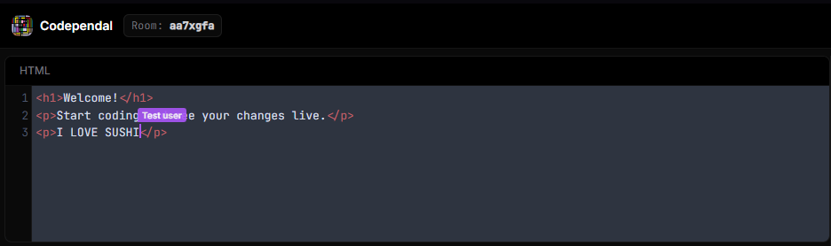
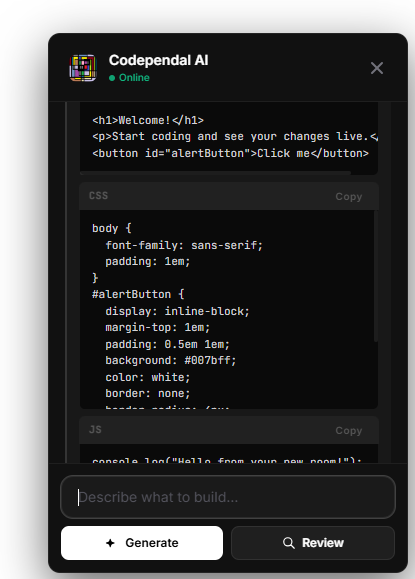
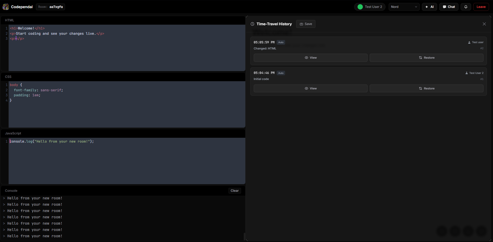
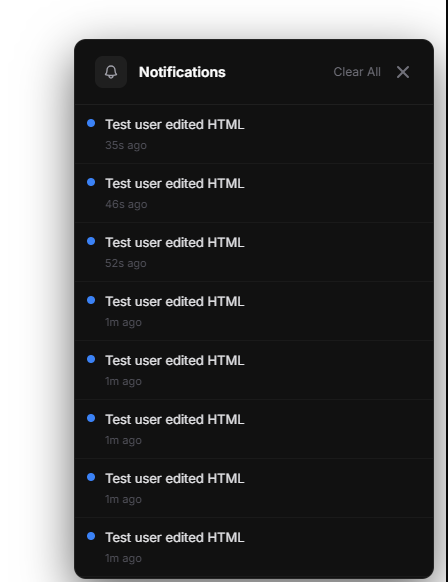
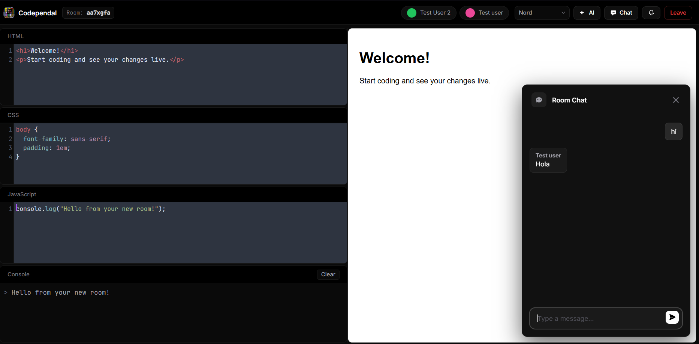

# Codependal

Welcome to the official documentation and issue tracker for **Codependal**, a high-performance, real-time collaborative code editor. 

> **Notice:** The source code for Codependal is closed and proprietary. This repository serves as the public-facing hub for user feedback, bug tracking, and feature roadmaps.

## License & Source Access

Codependal is proprietary software. The source code is closed and is not licensed for public distribution, modification, or commercial use. All rights are reserved. 

If you are interested in enterprise deployment, beta access, or special licensing, please contact the development team directly.

## Bug Reports & Feature Requests

While the source code is closed, we actively welcome feedback from our user community! If you encounter a bug or have an idea to improve the platform, please let us know:

1. Navigate to the **[Issues](../../issues)** tab in this repository.
2. Click **New Issue**.
3. Provide a clear description of the bug or feature request, including steps to reproduce if applicable.

## Support & Contact

For technical support, account issues, or business inquiries, please reach out to us at `abhay557.com@gmail.con ``contact@abhaymourya.in`.

## Overview

Codependal is engineered to enable seamless, latency-free pair programming and team collaboration. It provides a highly stable and synchronized environment for developers to write, review, and debug code together in real time, bridging the gap between distributed teams.

## Features

- **Real-time Collaboration:** Code together in absolute real-time without latency. Cursors and edits sync instantly across all clients in a room.
- **Cursor Sharing & Stability:** See where your collaborators are typing in real-time with color-coded, labeled cursor indicators, backed by a zero-layout-shift proxy mechanism.

- **Built-in AI Assistant:** A floating AI panel powered by Hugging Face (`Qwen2.5-Coder`). Describe what you want to build, and the AI will generate the HTML, CSS, and JS, injecting it directly into your editors.
- **AI Code Review:** Ask the AI to review your current code for bugs, best practices, accessibility, and performance optimizations.

- **Live Preview & Console:** Instantly view the results of your code in a sandboxed iframe. A built-in console helps you catch and debug JavaScript errors.
- **Tab-Freeze Security:** Built-in infinite loop protection monitors user JavaScript. If a script runs too long or freezes the iframe, it is automatically terminated. A "Safe Mode" toggle allows you to disable JavaScript entirely.
- **Time-Travel History & Diff Viewer:** Changes are automatically saved every 10 seconds. You can explicitly manually save milestones as well. Browse up to 50 previous versions of your room's code, and use the new "View" tool to launch a Git-style visualization modal showing character/line-level CSS, HTML, and JS differences.

- **Activity Notification Center:** A real-time notification feed tracks user presence, snapshot generation, and major code edits. A red notification badge alerts you via the platform's header.

- **Room Chat & Notifications:** Communicate with your team via the built-in room chat panel. If the chat panel is obscured and a peer sends a message, a highly visible status indicator flashes to notify you.

- **Zero Friction:** No accounts, no passwords, no setup. Click "Create Room," share the URL, and start coding within seconds.
- **Export Project:** One-click download of your entire workspace as a zipped `.zip` file, ready to be dropped into VS Code or deployed.
- **Premium UI:** A beautiful, responsive, and modern interface built with Tailwind CSS, featuring custom CodeMirror themes and warm orange/amber aesthetics.

---
